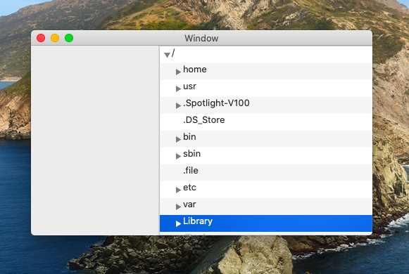

# OutlineViewDataSource

Basic Finder functionality

See: https://developer.apple.com/library/archive/documentation/Cocoa/Conceptual/OutlineView/Articles/UsingOutlineDataSource.html#//apple_ref/doc/uid/20000725-BBCDGDAG

